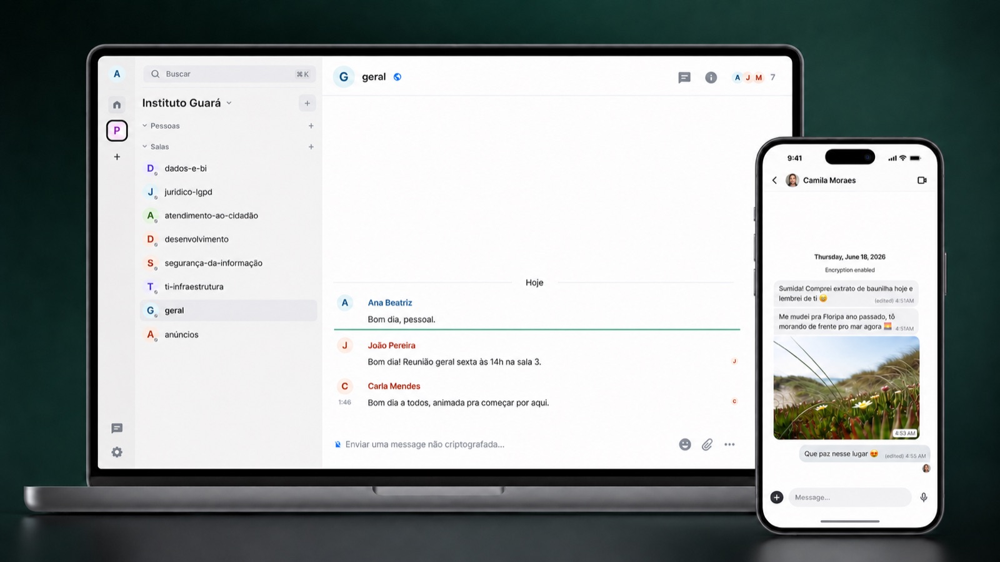

<p align="center">
  
</p>

<p align="center">
  
</p>

<div align="center">
    <h1>Gua for Web</h1>
</div>

**Gua** is a private messaging app for the web, built on top of [Matrix](https://matrix.org/).

This repository is Gua-ra's fork of [`element-hq/element-web`](https://github.com/element-hq/element-web) (Element Web). It carries the web client's share of Gua's product layer, not just a rebrand: resolver-based routing across a trusted federation of account providers, with the homeserver abstracted away from users; simplified onboarding — a phone number by default, flexible enough to sit in front of institutional SSO; and private contact discovery backed by query-only resolver lookups. The Gua brand and simplified settings round out the delta.

---

## What is different from Element Web

Gua Web layers Gua's routing and onboarding stack on top of Element Web. At sign-in, the
client resolves which trusted account provider serves a user (or should host a new
account) and hands off to it — via OIDC or a directly minted session — so users never
type or see a server name. The sign-in step itself is deliberately simple: today a phone
number plus a one-time code, with an optional PIN as a second step; because the hand-off
is standard OIDC, a provider can front its own flow instead, such as institutional SSO.

- **Phone/OTP onboarding.** A single sign-in and registration flow
  (`src/components/structures/auth/GuaAuthFlow.tsx`) drives phone entry, OTP
  verification, profile setup for new users, and an optional PIN (two-step
  verification) challenge for returning users.
- **Gua identity service client** (`src/identity/`). A REST client for the
  [Gua identity service](https://github.com/Gua-ra/identity-service) that handles
  OTP send/verify, signup completion, PIN management, account reauthentication,
  phone-number change, and account deactivation.
- **Resolver-based homeserver routing** (`src/gua/resolver/`). When configured, the
  phone-entry step asks the Gua resolver which account provider a phone number
  belongs to (or should be created on) before starting OIDC, so the client never
  hardcodes a server.
- **OIDC phone login** (`src/gua/oidc/`). Starts an OIDC authorization flow with the
  verified phone number passed as a login hint.
- **Gua branding and simplified settings.** Gua theme assets, plain-language
  encryption settings, and advanced options hidden from non-technical users
  (`src/gua/config.ts`, `src/gua/settings.ts`).

Everything else (build system, module system, theming, translations, testing) works
as in upstream Element Web; see the docs linked below.

## Quick start

Requirements: the current Node.js LTS and [Yarn Classic](https://classic.yarnpkg.com/en/docs/install).

```bash
git clone https://github.com/Gua-ra/gua-web.git
cd gua-web
yarn install
cp config.sample.json config.json   # then edit config.json (see below)
yarn start
```

The dev server listens on <http://localhost:8080>. The app reads `config.json` from the
web root at runtime; no rebuild is needed after config changes, just reload.

## Configuration

`config.sample.json` ships with neutral `gua.example` placeholders. Deployers supply
real values in their own `config.json`; no first-party host is baked into the source
or the build.

Gua-specific options (all in `config.json`):

| Option                      | Type     | Description                                                                                                                                                                                                                                     |
| --------------------------- | -------- | ----------------------------------------------------------------------------------------------------------------------------------------------------------------------------------------------------------------------------------------------- |
| `identity_service.base_url` | string   | Base URL of the Gua identity service. When set, the phone/OTP/PIN onboarding flow and the account-security settings (PIN, change number, deactivate) talk to this service. No trailing slash required.                                          |
| `gua_auth.phone_oidc_login` | boolean  | Enables the Gua phone onboarding flow for both sign-in and registration, replacing the stock login and registration screens. The flow is also enabled implicitly when `identity_service.base_url` is set.                                       |
| `gua_resolver.base_url`     | string   | Base URL of the Gua resolver (federation routing front door). When set, the phone-entry step resolves the phone number to its account provider before starting OIDC. Falls back to `default_server_config` when unset or when the lookup fails. |
| `default_server_config`     | object   | The default account provider. The sample uses the `gua.example` placeholders (`base_url: https://server.gua.example`, `server_name: gua.example`); replace them with your deployment's real values.                                             |
| `room_directory.servers`    | string[] | Servers to query in the public room directory. Defaults to `[]`; add your own servers if you want a directory.                                                                                                                                  |

All remaining options are inherited from upstream and documented in
[docs/config.md](docs/config.md).

## Building and deploying

- `yarn dist` builds a deployable tarball (not supported on Windows).
- `yarn build` builds the static app into `webapp/`, which can be served by any web
  server together with your `config.json`.
- The [Dockerfile](Dockerfile) copies `config.sample.json` to `/app/config.json` in the
  image as a placeholder. Mount or bake your real `config.json` over it when deploying.
- Serve the app from a different domain than your homeserver, set the recommended
  security headers, and keep `config*.json` and `index.html` uncached. See
  [Installing Element Web](docs/install.md) and the upstream
  [README](https://github.com/element-hq/element-web#important-security-notes) for
  details; they apply unchanged to Gua Web.

## Development

- [Developer guide](developer_guide.md)
- [Code style](code_style.md)
- [Contribution guide](CONTRIBUTING.md)
- Linting: `yarn lint` (or the narrower `yarn lint:types`, `yarn lint:js`,
  `yarn lint:style`)
- Tests: `yarn test` (Jest), `yarn test:playwright` (end-to-end)

Gua-specific code lives under `src/gua/` and `src/identity/`, with the onboarding UI in
`src/components/structures/auth/`. When pulling in upstream changes, keep the Gua delta
confined to those areas where possible.

## Upstream relationship

This repository is a fork of [element-hq/element-web](https://github.com/element-hq/element-web)
and tracks its `develop` branch. Upstream documentation under [docs/](docs/) still
applies unless noted otherwise. Element, Matrix, and related marks belong to their
respective owners.

## Copyright and license

Copyright (c) 2014-2017 OpenMarket Ltd
Copyright (c) 2017 Vector Creations Ltd
Copyright (c) 2017-2025 New Vector Ltd
Copyright (c) 2025-2026 Gua contributors

Like upstream Element Web, this software is multi-licensed by New Vector Ltd (Element):
under the GNU Affero General Public License (version 3 or later), under the GNU General
Public License (version 3 or later), or under a paid-for Element Commercial License. See
[LICENSE-AGPL-3.0](LICENSE-AGPL-3.0), [LICENSE-GPL-3.0](LICENSE-GPL-3.0), and
[LICENSE-COMMERCIAL](LICENSE-COMMERCIAL) for the full terms.
